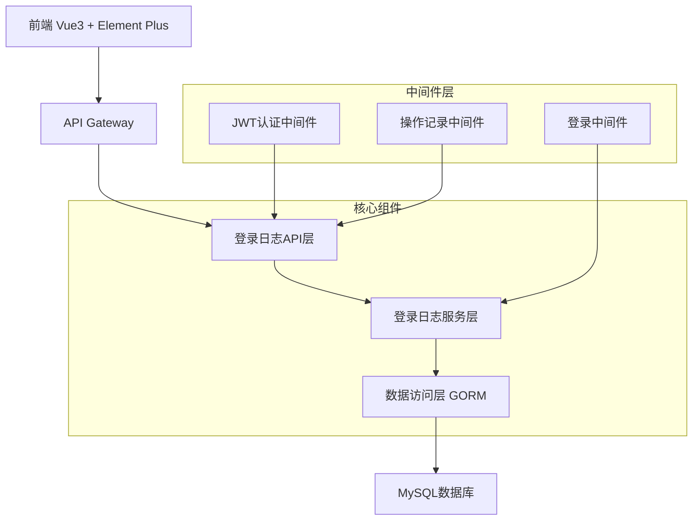

# 登录日志管理功能设计文档

## 概述

登录日志管理功能是基于gin-vue-admin框架开发的系统安全监控模块。该功能采用前后端分离架构，后端使用Gin框架提供RESTful API，前端使用Vue3 + Element Plus构建用户界面。系统将自动记录所有用户的登录活动，并为管理员提供完整的查询、筛选、导出和管理功能。

## 架构设计

### 系统架构图



### 技术栈

- **后端**: Go 1.22 + Gin + GORM + MySQL
- **前端**: Vue3 + Element Plus + Pinia + Axios
- **数据库**: MySQL 5.7+
- **缓存**: Redis (用于登录状态管理)
- **认证**: JWT Token

## 组件和接口设计

### 数据模型

#### 登录日志模型 (SysLoginLog)

```go
type SysLoginLog struct {
    global.GVA_MODEL
    UserID       uint      `json:"userId" gorm:"index;comment:用户ID"`
    Username     string    `json:"username" gorm:"index;comment:用户名"`
    LoginIP      string    `json:"loginIp" gorm:"index;comment:登录IP地址"`
    LoginTime    time.Time `json:"loginTime" gorm:"comment:登录时间"`
    LogoutTime   *time.Time `json:"logoutTime" gorm:"comment:退出时间"`
    UserAgent    string    `json:"userAgent" gorm:"type:text;comment:用户代理"`
    Browser      string    `json:"browser" gorm:"comment:浏览器"`
    OS           string    `json:"os" gorm:"comment:操作系统"`
    Device       string    `json:"device" gorm:"comment:设备类型"`
    Location     string    `json:"location" gorm:"comment:登录地点"`
    Status       int       `json:"status" gorm:"default:1;comment:登录状态 1成功 2失败"`
    FailReason   string    `json:"failReason" gorm:"comment:失败原因"`
    Duration     int64     `json:"duration" gorm:"comment:登录持续时间(秒)"`
    SessionID    string    `json:"sessionId" gorm:"index;comment:会话ID"`
}
```

#### 请求/响应模型

```go
// 登录日志查询请求
type LoginLogSearchReq struct {
    request.PageInfo
    Username   string    `json:"username" form:"username"`
    LoginIP    string    `json:"loginIp" form:"loginIp"`
    Status     *int      `json:"status" form:"status"`
    StartTime  time.Time `json:"startTime" form:"startTime"`
    EndTime    time.Time `json:"endTime" form:"endTime"`
}

// 登录日志响应
type LoginLogResponse struct {
    List  []SysLoginLog `json:"list"`
    Total int64         `json:"total"`
    Page  int           `json:"page"`
    PageSize int        `json:"pageSize"`
}
```

### API接口设计

#### 1. 获取登录日志列表
- **路径**: `POST /loginLog/getLoginLogList`
- **方法**: POST
- **权限**: 需要管理员权限
- **请求体**: LoginLogSearchReq
- **响应**: LoginLogResponse

#### 2. 获取登录日志详情
- **路径**: `GET /loginLog/getLoginLogDetail/:id`
- **方法**: GET
- **权限**: 需要管理员权限
- **参数**: id (登录日志ID)
- **响应**: SysLoginLog

#### 3. 导出登录日志
- **路径**: `POST /loginLog/exportLoginLog`
- **方法**: POST
- **权限**: 需要管理员权限
- **请求体**: LoginLogSearchReq
- **响应**: Excel文件流

#### 4. 删除登录日志
- **路径**: `DELETE /loginLog/deleteLoginLog`
- **方法**: DELETE
- **权限**: 需要超级管理员权限
- **请求体**: `{"ids": [1,2,3]}`
- **响应**: 操作结果

#### 5. 清理过期日志
- **路径**: `POST /loginLog/cleanExpiredLogs`
- **方法**: POST
- **权限**: 需要超级管理员权限
- **请求体**: `{"days": 90}`
- **响应**: 清理结果

### 服务层设计

#### LoginLogService 接口

```go
type LoginLogService interface {
    // 记录登录日志
    RecordLoginLog(userID uint, username string, ip string, userAgent string, status int, failReason string) error
    
    // 更新登出时间
    UpdateLogoutTime(sessionID string) error
    
    // 获取登录日志列表
    GetLoginLogList(req LoginLogSearchReq) ([]SysLoginLog, int64, error)
    
    // 获取登录日志详情
    GetLoginLogDetail(id uint) (SysLoginLog, error)
    
    // 导出登录日志
    ExportLoginLog(req LoginLogSearchReq) ([]byte, error)
    
    // 删除登录日志
    DeleteLoginLog(ids []uint) error
    
    // 清理过期日志
    CleanExpiredLogs(days int) (int64, error)
}
```

### 前端组件设计

#### 1. 登录日志列表页面 (LoginLogList.vue)

**组件结构**:
```vue
<template>
  <div class="login-log-container">
    <!-- 搜索区域 -->
    <div class="gva-search-box">
      <el-form :inline="true" :model="searchInfo">
        <el-form-item label="用户名">
          <el-input v-model="searchInfo.username" placeholder="请输入用户名" />
        </el-form-item>
        <el-form-item label="IP地址">
          <el-input v-model="searchInfo.loginIp" placeholder="请输入IP地址" />
        </el-form-item>
        <el-form-item label="登录状态">
          <el-select v-model="searchInfo.status" placeholder="请选择状态">
            <el-option label="成功" :value="1" />
            <el-option label="失败" :value="2" />
          </el-select>
        </el-form-item>
        <el-form-item label="时间范围">
          <el-date-picker
            v-model="timeRange"
            type="datetimerange"
            range-separator="至"
            start-placeholder="开始时间"
            end-placeholder="结束时间"
          />
        </el-form-item>
        <el-form-item>
          <el-button type="primary" @click="onSubmit">查询</el-button>
          <el-button @click="onReset">重置</el-button>
        </el-form-item>
      </el-form>
    </div>

    <!-- 操作按钮区域 -->
    <div class="gva-btn-list">
      <el-button type="primary" @click="exportData">导出Excel</el-button>
      <el-button type="danger" @click="cleanLogs">清理日志</el-button>
    </div>

    <!-- 表格区域 -->
    <el-table :data="tableData" @row-click="showDetail">
      <el-table-column prop="username" label="用户名" />
      <el-table-column prop="loginIp" label="IP地址" />
      <el-table-column prop="location" label="登录地点" />
      <el-table-column prop="browser" label="浏览器" />
      <el-table-column prop="os" label="操作系统" />
      <el-table-column prop="loginTime" label="登录时间" />
      <el-table-column prop="status" label="状态">
        <template #default="scope">
          <el-tag :type="scope.row.status === 1 ? 'success' : 'danger'">
            {{ scope.row.status === 1 ? '成功' : '失败' }}
          </el-tag>
        </template>
      </el-table-column>
    </el-table>

    <!-- 分页 -->
    <el-pagination
      v-model:current-page="page"
      v-model:page-size="pageSize"
      :total="total"
      @current-change="getTableData"
      @size-change="getTableData"
    />
  </div>
</template>
```

#### 2. 登录日志详情弹窗 (LoginLogDetail.vue)

**主要功能**:
- 显示完整的登录信息
- 显示用户代理字符串解析结果
- 显示地理位置详细信息
- 显示登录持续时间

#### 3. 前端API服务 (loginLog.js)

```javascript
import service from '@/utils/request'

// 获取登录日志列表
export const getLoginLogList = (data) => {
  return service({
    url: '/loginLog/getLoginLogList',
    method: 'post',
    data
  })
}

// 获取登录日志详情
export const getLoginLogDetail = (id) => {
  return service({
    url: `/loginLog/getLoginLogDetail/${id}`,
    method: 'get'
  })
}

// 导出登录日志
export const exportLoginLog = (data) => {
  return service({
    url: '/loginLog/exportLoginLog',
    method: 'post',
    data,
    responseType: 'blob'
  })
}

// 清理过期日志
export const cleanExpiredLogs = (data) => {
  return service({
    url: '/loginLog/cleanExpiredLogs',
    method: 'post',
    data
  })
}
```

## 数据模型设计

### 数据库表结构

```sql
CREATE TABLE `sys_login_logs` (
  `id` bigint(20) unsigned NOT NULL AUTO_INCREMENT,
  `created_at` datetime(3) DEFAULT NULL,
  `updated_at` datetime(3) DEFAULT NULL,
  `deleted_at` datetime(3) DEFAULT NULL,
  `user_id` bigint(20) unsigned DEFAULT NULL COMMENT '用户ID',
  `username` varchar(191) DEFAULT NULL COMMENT '用户名',
  `login_ip` varchar(45) DEFAULT NULL COMMENT '登录IP地址',
  `login_time` datetime(3) DEFAULT NULL COMMENT '登录时间',
  `logout_time` datetime(3) DEFAULT NULL COMMENT '退出时间',
  `user_agent` text COMMENT '用户代理',
  `browser` varchar(100) DEFAULT NULL COMMENT '浏览器',
  `os` varchar(100) DEFAULT NULL COMMENT '操作系统',
  `device` varchar(100) DEFAULT NULL COMMENT '设备类型',
  `location` varchar(200) DEFAULT NULL COMMENT '登录地点',
  `status` tinyint(4) DEFAULT '1' COMMENT '登录状态 1成功 2失败',
  `fail_reason` varchar(500) DEFAULT NULL COMMENT '失败原因',
  `duration` bigint(20) DEFAULT NULL COMMENT '登录持续时间(秒)',
  `session_id` varchar(100) DEFAULT NULL COMMENT '会话ID',
  PRIMARY KEY (`id`),
  KEY `idx_sys_login_logs_deleted_at` (`deleted_at`),
  KEY `idx_sys_login_logs_user_id` (`user_id`),
  KEY `idx_sys_login_logs_username` (`username`),
  KEY `idx_sys_login_logs_login_ip` (`login_ip`),
  KEY `idx_sys_login_logs_session_id` (`session_id`),
  KEY `idx_sys_login_logs_login_time` (`login_time`)
) ENGINE=InnoDB DEFAULT CHARSET=utf8mb4 COMMENT='登录日志表';
```

### 索引设计

1. **主键索引**: `id` (自动创建)
2. **用户索引**: `user_id`, `username` (支持按用户查询)
3. **IP索引**: `login_ip` (支持按IP查询)
4. **时间索引**: `login_time` (支持时间范围查询)
5. **会话索引**: `session_id` (支持会话管理)
6. **软删除索引**: `deleted_at` (GORM自动创建)

## 错误处理

### 错误码定义

```go
const (
    LoginLogNotFound     = 40001 // 登录日志不存在
    LoginLogCreateFailed = 40002 // 创建登录日志失败
    LoginLogUpdateFailed = 40003 // 更新登录日志失败
    LoginLogDeleteFailed = 40004 // 删除登录日志失败
    LoginLogExportFailed = 40005 // 导出登录日志失败
    InvalidTimeRange     = 40006 // 无效的时间范围
    InsufficientPermission = 40007 // 权限不足
)
```

### 错误处理策略

1. **数据库错误**: 记录详细错误日志，返回通用错误信息
2. **参数验证错误**: 返回具体的参数错误信息
3. **权限错误**: 返回权限不足提示
4. **系统错误**: 记录错误日志，返回系统繁忙提示

## 测试策略

### 单元测试

1. **模型测试**: 测试数据模型的验证规则
2. **服务测试**: 测试业务逻辑的正确性
3. **API测试**: 测试接口的输入输出

### 集成测试

1. **数据库集成测试**: 测试数据持久化功能
2. **API集成测试**: 测试完整的请求响应流程
3. **前端集成测试**: 测试用户界面交互

### 性能测试

1. **查询性能测试**: 测试大数据量下的查询性能
2. **并发测试**: 测试高并发登录记录的处理能力
3. **导出性能测试**: 测试大量数据导出的性能

## 安全考虑

### 数据安全

1. **敏感信息脱敏**: 对IP地址进行部分脱敏显示
2. **数据加密**: 对敏感字段进行加密存储
3. **访问控制**: 严格的权限控制，只有管理员可以查看

### 系统安全

1. **SQL注入防护**: 使用GORM的参数化查询
2. **XSS防护**: 前端输出转义
3. **CSRF防护**: 使用CSRF Token
4. **权限验证**: 每个接口都进行权限验证

### 隐私保护

1. **数据最小化**: 只记录必要的登录信息
2. **数据保留**: 设置合理的数据保留期限
3. **匿名化**: 对历史数据进行匿名化处理

## 监控和日志

### 系统监控

1. **性能监控**: 监控API响应时间和数据库查询性能
2. **错误监控**: 监控系统错误和异常情况
3. **容量监控**: 监控数据库存储容量和增长趋势

### 操作日志

1. **管理操作日志**: 记录管理员的所有操作
2. **系统日志**: 记录系统运行状态和错误信息
3. **审计日志**: 记录敏感操作的审计信息