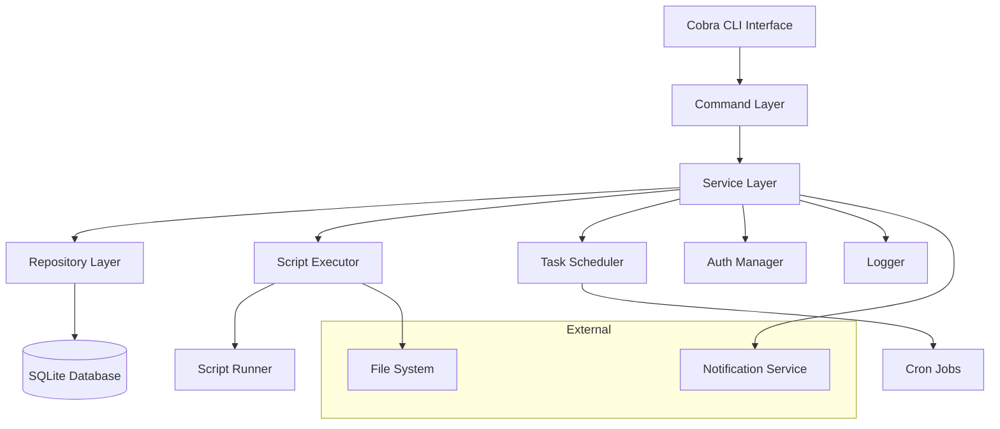

# Design Document

## Overview

Cobra 脚本中心采用模块化架构设计，基于 Go Cobra 框架构建命令行界面，使用 SQLite 作为本地数据存储，支持脚本的 CRUD 操作、执行调度、权限管理和监控功能。系统设计遵循单一职责原则，确保各模块间低耦合高内聚。

## Architecture



## Components and Interfaces

### 1. Command Layer (cmd/)
负责处理命令行交互和参数解析。

**主要命令：**
- `script create` - 创建新脚本
- `script list` - 列出脚本
- `script edit` - 编辑脚本
- `script delete` - 删除脚本
- `script run` - 执行脚本
- `script schedule` - 设置定时任务
- `user create` - 创建用户
- `user login` - 用户登录
- `daemon start` - 启动守护进程

### 2. Service Layer (internal/service/)
业务逻辑处理层。

**ScriptService:**
```go
type ScriptService interface {
    CreateScript(script *Script) error
    UpdateScript(id string, script *Script) error
    DeleteScript(id string) error
    GetScript(id string) (*Script, error)
    ListScripts(filter *ScriptFilter) ([]*Script, error)
    ExecuteScript(id string, params map[string]string) (*ExecutionResult, error)
}
```

**UserService:**
```go
type UserService interface {
    CreateUser(user *User) error
    Authenticate(username, password string) (*User, error)
    CheckPermission(userID, scriptID string, action string) bool
}
```

**SchedulerService:**
```go
type SchedulerService interface {
    ScheduleScript(scriptID, cronExpr string) error
    UnscheduleScript(scriptID string) error
    ListScheduledTasks() ([]*ScheduledTask, error)
}
```

### 3. Repository Layer (internal/repository/)
数据访问层，负责与数据库交互。

**ScriptRepository:**
```go
type ScriptRepository interface {
    Create(script *Script) error
    Update(script *Script) error
    Delete(id string) error
    FindByID(id string) (*Script, error)
    FindAll(filter *ScriptFilter) ([]*Script, error)
}
```

### 4. Executor Module (internal/executor/)
脚本执行引擎。

**ScriptExecutor:**
```go
type ScriptExecutor interface {
    Execute(script *Script, params map[string]string) (*ExecutionResult, error)
    ExecuteAsync(script *Script, params map[string]string) (string, error)
    GetExecutionStatus(executionID string) (*ExecutionStatus, error)
}
```

## Data Models

### Script Model
```go
type Script struct {
    ID          string    `json:"id" db:"id"`
    Name        string    `json:"name" db:"name"`
    Description string    `json:"description" db:"description"`
    Content     string    `json:"content" db:"content"`
    Language    string    `json:"language" db:"language"` // bash, python, etc.
    Tags        []string  `json:"tags" db:"tags"`
    CreatedBy   string    `json:"created_by" db:"created_by"`
    CreatedAt   time.Time `json:"created_at" db:"created_at"`
    UpdatedAt   time.Time `json:"updated_at" db:"updated_at"`
    Version     int       `json:"version" db:"version"`
    IsActive    bool      `json:"is_active" db:"is_active"`
}
```

### User Model
```go
type User struct {
    ID        string    `json:"id" db:"id"`
    Username  string    `json:"username" db:"username"`
    Password  string    `json:"-" db:"password_hash"`
    Role      string    `json:"role" db:"role"` // admin, user, viewer
    CreatedAt time.Time `json:"created_at" db:"created_at"`
    IsActive  bool      `json:"is_active" db:"is_active"`
}
```

### Execution Model
```go
type Execution struct {
    ID        string            `json:"id" db:"id"`
    ScriptID  string            `json:"script_id" db:"script_id"`
    UserID    string            `json:"user_id" db:"user_id"`
    Status    string            `json:"status" db:"status"` // running, success, failed
    StartTime time.Time         `json:"start_time" db:"start_time"`
    EndTime   *time.Time        `json:"end_time" db:"end_time"`
    Output    string            `json:"output" db:"output"`
    Error     string            `json:"error" db:"error"`
    Params    map[string]string `json:"params" db:"params"`
}
```

### Scheduled Task Model
```go
type ScheduledTask struct {
    ID         string    `json:"id" db:"id"`
    ScriptID   string    `json:"script_id" db:"script_id"`
    CronExpr   string    `json:"cron_expr" db:"cron_expr"`
    CreatedBy  string    `json:"created_by" db:"created_by"`
    CreatedAt  time.Time `json:"created_at" db:"created_at"`
    IsActive   bool      `json:"is_active" db:"is_active"`
    LastRun    *time.Time `json:"last_run" db:"last_run"`
    NextRun    *time.Time `json:"next_run" db:"next_run"`
}
```

## Error Handling

### Error Types
```go
var (
    ErrScriptNotFound     = errors.New("script not found")
    ErrPermissionDenied   = errors.New("permission denied")
    ErrInvalidScript      = errors.New("invalid script content")
    ErrExecutionFailed    = errors.New("script execution failed")
    ErrUserNotFound       = errors.New("user not found")
    ErrInvalidCredentials = errors.New("invalid credentials")
)
```

### Error Handling Strategy
1. **命令层错误处理：** 捕获并格式化错误信息，提供用户友好的错误提示
2. **服务层错误处理：** 记录详细错误日志，返回标准化错误类型
3. **执行器错误处理：** 捕获脚本执行错误，保存错误输出和堆栈信息
4. **数据库错误处理：** 处理连接错误、约束违反等数据库相关错误

## Testing Strategy

### Unit Testing
- **Service Layer：** 使用 mock repository 测试业务逻辑
- **Repository Layer：** 使用内存数据库测试数据访问逻辑
- **Executor：** 测试脚本执行和错误处理

### Integration Testing
- **Command Testing：** 测试完整的命令执行流程
- **Database Testing：** 测试数据库迁移和数据一致性
- **Scheduler Testing：** 测试定时任务的创建和执行

### End-to-End Testing
- **CLI Testing：** 测试完整的用户交互流程
- **Script Execution：** 测试各种类型脚本的执行
- **Permission Testing：** 测试权限控制的有效性

## Security Considerations

1. **脚本内容验证：** 检查脚本内容，防止恶意代码执行
2. **执行环境隔离：** 在受限环境中执行脚本，限制系统访问
3. **权限控制：** 基于角色的访问控制，确保用户只能访问授权的脚本
4. **审计日志：** 记录所有操作和执行历史，便于安全审计
5. **密码安全：** 使用 bcrypt 加密存储用户密码
6. **输入验证：** 验证所有用户输入，防止注入攻击

## Performance Considerations

1. **并发控制：** 限制同时执行的脚本数量，防止系统资源耗尽
2. **缓存策略：** 缓存频繁访问的脚本内容和用户信息
3. **数据库优化：** 为常用查询字段添加索引
4. **日志管理：** 定期清理旧的执行日志，控制数据库大小
5. **异步执行：** 长时间运行的脚本使用异步执行模式